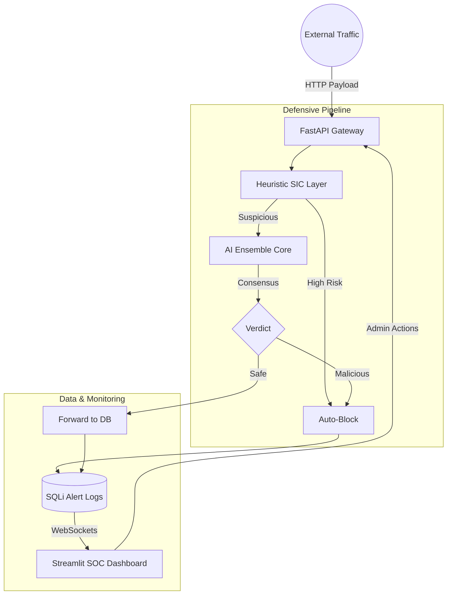

# 🛡️ Aegis Sentinel: AI-Powered SQLi Detection System

[](https://fastapi.tiangolo.com/)
[](https://streamlit.io/)
[](https://www.docker.com/)
[](https://www.python.org/)

**Aegis Sentinel** is an enterprise-grade cybersecurity solution designed to detect and intercept SQL Injection (SQLi) attacks using a multi-layered defensive strategy. It combines traditional heuristic analysis with a high-fidelity AI Ensemble model to provide real-time threat intelligence and automated mitigation.

---

## 🌟 Key Features

*   **🧠 Hybrid Detection Engine**: Combines a **Heuristic Structural Integrity Check (SIC)** with an **AI Ensemble Layer** (XGBoost, LSTM, Random Forest, LightGBM, etc.).
*   **⚖️ Model Consensus Intelligence**: Uses a weighted voting mechanism across multiple ML models to reach a high-confidence verdict.
*   **🖥️ Glassmorphic SOC Dashboard**: A professional, real-time Security Operations Center (SOC) interface built with Streamlit, featuring live telemetry and WebSocket event streams.
*   **🔍 Explainable AI (XAI)**: Diagnostic radar charts, risk gauges, and semantic trigger analysis to explain *why* a payload was blocked.
*   **🛡️ Real-Time Interception**: Simulated WAF (Web Application Firewall) functionality that logs, blocks, and broadcasts alerts instantly.
*   **🔐 Secure Operator Access**: Industry-standard JWT (JSON Web Token) authentication for security personnel.
*   **🐳 Containerized Architecture**: Fully dockerized for seamless deployment across environments.

---

## 🏗️ System Architecture



---

## 🛠️ Tech Stack

-   **Backend:** FastAPI, Uvicorn, SQLAlchemy (SQLite), Python-Jose (JWT)
-   **Frontend:** Streamlit, Plotly, HTML5/CSS3 (Glassmorphism)
-   **Machine Learning:** Scikit-learn, XGBoost, LightGBM, TensorFlow (LSTM), Joblib
-   **DevOps:** Docker, Docker Compose
-   **Communication:** WebSockets (Real-time alerts)

---

## 🚀 Getting Started

### Prerequisites

-   Python 3.9+
-   Docker & Docker Compose (Optional, but recommended)

### Quick Start (Docker)

The easiest way to get Aegis Sentinel running is via Docker Compose:

```bash
# Clone the repository
git clone https://github.com/your-username/aegis-sentinel.git
cd aegis-sentinel

# Build and start the containers
docker-compose up --build
```

Access the **SOC Dashboard** at `http://localhost:8501` and the **API Docs** at `http://localhost:8000/docs`.

### Manual Installation (Local)

1.  **Set up a virtual environment:**
    ```bash
    python -m venv venv
    source venv/bin/activate  # On Windows: venv\Scripts\activate
    ```

2.  **Install dependencies:**
    ```bash
    pip install -r requirements.txt
    ```

3.  **Run the API:**
    ```bash
    uvicorn api.main:app --host 0.0.0.0 --port 8000
    ```

4.  **Run the Dashboard (New terminal)::**
    ```bash
    streamlit run ui/app.py
    ```

---

## 📊 Model Performance

Aegis Sentinel utilizes a weighted ensemble of several high-performance models:

| Model Layer | Accuracy | Role |
| :--- | :--- | :--- |
| **XGBoost** | 98.2% | Semantic Pattern Recognition |
| **LSTM** | 96.5% | Sequential Dependency Analysis |
| **Random Forest** | 97.1% | Feature Importance Validation |
| **SIC (Heuristic)** | N/A | High-Speed Structural Filtering |

The system reaches a verdict based on **Model Consensus**, ensuring that false positives are minimized while detection rates remain near 100% for known SQLi vectors.

---

## 📸 Dashboard Preview

*(Add your screenshots here)*

> **Note:** The UI features a dark-themed, glassmorphic design inspired by modern SOC environments, optimized for high-density information display.

---

## 📄 License

Distributed under the MIT License. See `LICENSE` for more information.

---

Developed with ❤️ for Advanced AI Cybersecurity.
